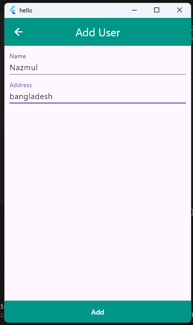
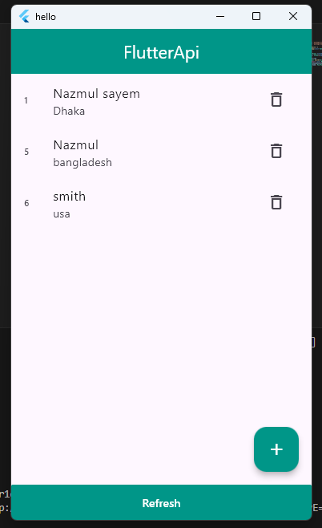
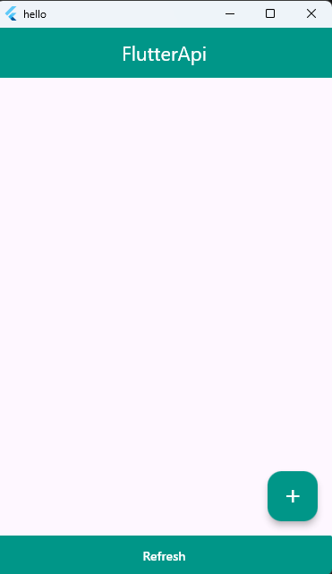

# User Management System

A complete CRUD application with Flutter frontend and .NET backend for managing user data.

 
 
 

## Features

- **Frontend (Flutter)**:
  - List all users
  - Add new users
  - Edit existing users
  - Delete users
  - Form validation
  - Responsive design

- **Backend (.NET)**:
  - RESTful API endpoints
  - Entity Framework Core for data access
  - SQL Server database
  - Model validation

## Technologies Used

### Frontend
- Flutter 3.x
- http (for API calls)
- flutter_form_builder (for forms)
- form_builder_validators

### Backend
- .NET core 9
- Entity Framework Core
- SQL Server
- ASP.NET Core Web API

## Project Structure
